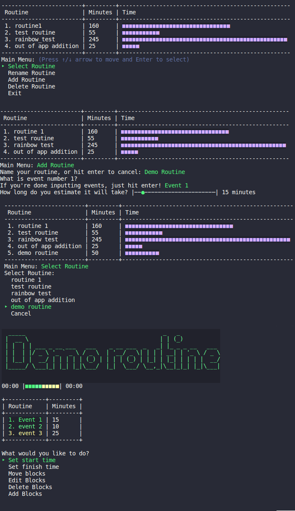
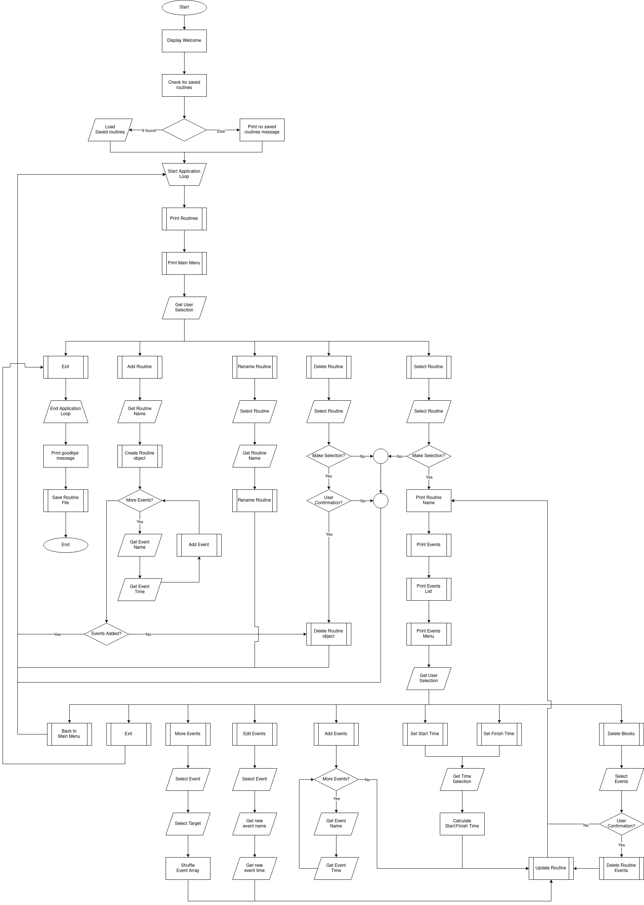
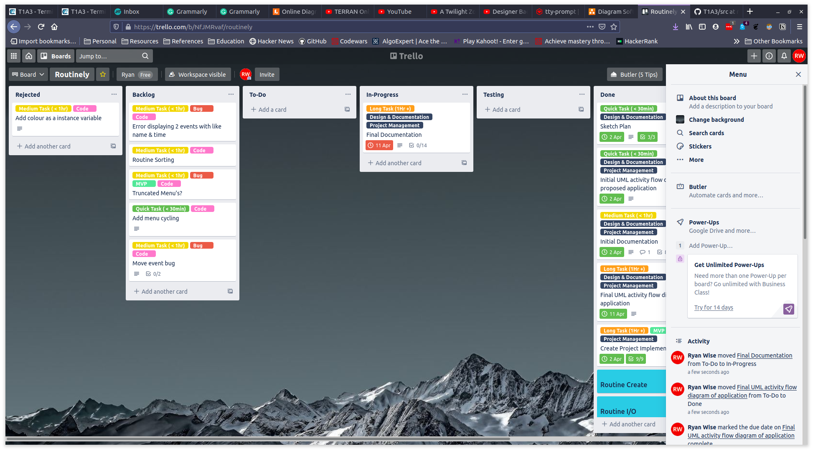

# Routinely

A terminal app to create and organise personal routines or events.

## R3 - Sources

Not Applicable

## R4 - Location

The [Application Repository is stored on Github](https://github.com/ryanjwise/routinely)

## R5 - Software Development Plan

### R5 - Application purpose and scope

#### Application Intent

- Routinely aims to provide a method for users to quickly create and reorder a sequence of events or tasks.

#### The Problem

- Sometimes you need to plan out a series of tasks, or even a sequence of events. Usually, the best and quickest way to do this is to jot it down on a piece of paper. However, this becomes a problem if that sequence is something you want to refer to later or even refine. You could lose the paper and have to start again, or in the case of reshuffling need to rewrite the list. All well and good while the list is short, but once it reaches a certain length this becomes a tedious process. Routinely aims to solve this problem by allowing a user to quickly add a name and estimated time for each event and storing the subsequent sequence in a routine. This will allow the user to save, edit and even shuffle the sequence of events as they see fit.

#### The Audience

- Routinely has a wide range of potential users:
  - Everyday
    - Maybe you're somebody trying to work out a morning routine or plan the perfect exercise plan, Routinely's got you.
  - Event Organisers
    - Planning big events and need to work out the order things need to happen? Maybe your frontrunner is running late and you need to shuffle the plan around at the last minute to keep the show running. Routinely's got you.
  - Developers
    - Doing a routine task and need to know how long it'll take? Or starting a new project and want to be sure you don't skip a step? Stop guessing and use Routinely.

#### User Interaction

- The first iteration of Routinely is a prototype operated through the terminal, but it's designed to be quick, easy and fast. There's no reason a GUI couldn't sit on top of it further down the line.
- The first time a user fires up Routinely they will have one option, to create a new Routine!
  - The user will be asked to name the routine for later reference, not to worry if they're not sure exactly want to call it yet. This can be changed later!
  - Next The routine will ask for the name of the first task and the time you expect it to take. It'll keep doing this until you tell it you're done.
  -Then it'll show you you're routine both graphically and as a table. You can select individual elements, change them, or even shuffle them around as you see fit. When you're done either quit or go back to the main menu and you're routine will be saved!
- Any time you open routinely in the future you're saved routines will be shown in brief form at the top, you can select one to view or edit, or create a new routine from here!

### R6 - Features

#### Minimum Viable Product:

1. Create, Read, Update, and Delete routines
    - To serve as anything more than a useful planning tool, Routinely must have the capability to Create, Store, Edit, and Delete Routines. To meet this requirement, routinely must have the following:
File In/Out capabilities
Ability to create objects based on user input
Modification of created objects based on user input
Deletion of created objects based on user input
1. Quick and Easy data entry
    - For Routinely to be competitive with pen and paper it needs to offer fast and effective data entry to its users. To achieve this it needs to have:
	    - Simple and clear user Interface
	    - Robust and discreet error handling of user input
	    - Simple methods for the user to select and interact with objects.
1. Visual display of routines for fast reference
    - To be competitive, Routinely must be able to show the sequence of events both visually, and in list format. This will allow quick reference in a format the user will likely already be familiar with. This will be achieved in two ways:
      1. Saved Routines and events will be displayed in tabular format, depicting both name and time of either.
      2. Events will be displayed as a coloured bar to depict the relative time of each event in the sequence.
1. Time calculations
    - In the event users are working with a routine where starting or finishing times are critical, Routinely will have the capacity to calculate the time a user is required to start working on, or could expect to finish a routine.  
    - To achieve this it will store the aggregate time of all events in the sequence, and use this along with a time input by the user to calculate either backwards or forwards. 
    - The resultant start and finish times will also be stored against the routine.

Additional:

- Commandline Arguments
  - For the advanced user methods will be made available to perform the following operations through the command line:
    - Add a new Routine
    - Edit an existing Routine
    - Print available Routines
    - Print a specific Routine

### R7 - User Interaction

#### UI Documentation & Usage

- I believe that Routinely is fairly straightforward in its use, and the menu system does a good job of guiding users throughout the process. (See Below for demo walkthrough)
- Alternatively, if the user uses the `-h` or `--help` command line arguments, the following prompt will be displayed:

```text
Routinely aims to provide a method for users to quickly create and reorder a sequence of events or tasks.
To get started, load the application and select 'add routine'.

Once a routine has been established it is populated with a series of events, to manipulate these events select the routine.
Once within a routine, events can be added or deleted, edited and reordered.
A start or end time for the running of the entire routine can also be input with the respective menu options.

To save, either return to the main menu, or select Exit.
N.B. If the application is quit in any other way, progress will not be saved.

ruby routinely.rb [options] [arg_name]

Options:
        -add                    Jumps straight to the add new routine screen, then saves on completion and exits
        -view                   Prints available routines
        -view [-r]              Prints available routines, then allow user to select an option and jump straight to edit
        -view [routine_name]    Prints the input routine and exits
```

- 

#### Error Handling

- The majority of errors that can be introduced into Routinely come in the form of erroneous user input.
- To combat this the gem [tty-prompt](https://rubygems.org/gems/tty-prompt) was used to reduce the possible array of input errors. Where only an Integer should be received, `tty-prompt` has inbuilt catches to prevent strings from being entered. Typically the user will be prompted for correct input, then the prompt will first limit data methods if possible(the input time in the above demo is an example of this). When this is not an option, guard clauses are implemented to prevent erroneous input. For example, when entering a new routine, entering an empty string is presented as an option to cancel to the user. This however also functions to guard against errors introduced when trying to access a routine with no name.
- The only error that should be displayed to the user is when they attempt to create a routine without any events. This will inform the user what went wrong, and return them to the start of the add_routine method where they can either restart inputting or cancel.

### R8 - Control Flow Diagram



### R9 - Implementation Plan

The [project management board can be found here](https://trello.com/b/NfJMRvaf/routinely).

Below is a screenshot taken at the time of writting:


### R10 - Instalation and Usage

#### Installation

Routinely was created and tested on Linux using `Ruby version 2.7.2`, and `Rspec version 3.10.1` Niether are included as dependencies in the automated installation.

1. Clone this repository to your local machine.
2. Open the terminal and and `cd` into `<filepath>/routinely/src`
3. Either install and run manually, or run the provided shell script:
    1. Install manually:

       ```text
        bundle install
        ruby routinely.rb
        ```

    2. Run the provided shell script:

        ```text
        ./routinely.sh
        ```

4. Either run method can be run with the following command line arguments:

    ```text
    ruby routinely.rb [options] [arg_name]

    Options:
            -h                      Print help file
            -add                    Jumps straight to the add new routine screen, then saves on completion and exits
            -view                   Prints available routines
            -view [-r]              Prints available routines, then allow user to select an option and jump straight to edit
            -view [routine_name]    Prints the input routine and exits
    ```

#### Dependencies

Routinely was created and tested on Linux using `Ruby version 2.7.2`, and `Rspec version 3.10.1` Niether are included as dependencies in the automated installation.

The following gems are installed as dependencies for the application:

- [bundler](https://rubygems.org/gems/bundler)
  - Maintains the dependency list, and controls automatic installation of required versions.
- [tty-prompt](https://rubygems.org/gems/tty-prompt)
  - Menu navigation and error handling.
- [colorize](https://rubygems.org/gems/colorize)
  - Adds colour output to the terminal
- [terminal-table](https://rubygems.org/gems/terminal-table)
  - Helper methods for producing tables in the terminal
