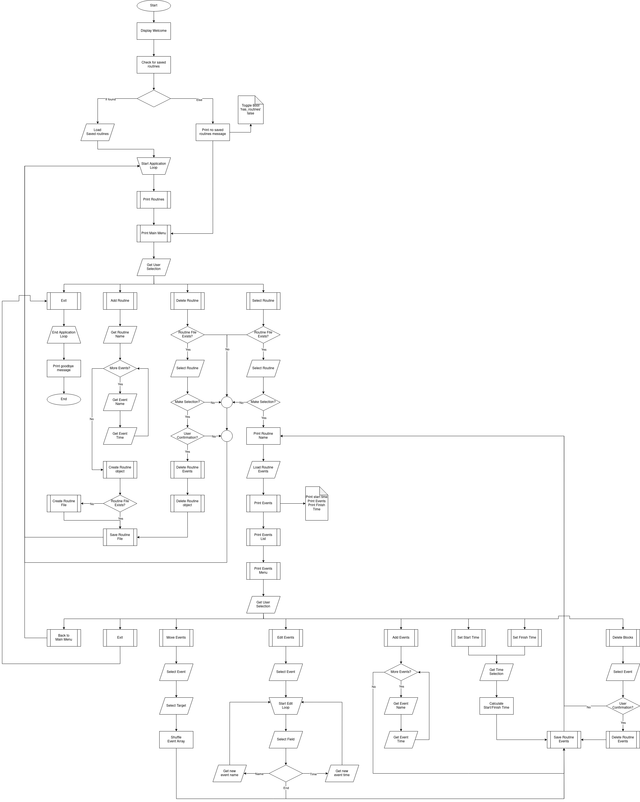

# routinely

A terminal app to create and organise personal routines or events.

## Release Checklist

- Application runs
- MVP features implemented
- Testing included
- Run Script included in src
- All Documentation below complete
- Kanban publicly accessible

[//]: # (Comment)

## R3 - Sources

*Any referenced sources if aplicable

## R4 - Location

The [Application Repository is stored on Github](https://github.com/ryanjwise/routinely)

## R5 - Software Development Plan

### R5 - Application purpose and scope

[//]: # (describe at a high level what the application will do)

- Routinely aims to provide a method for users to quickly create and reorder a sequence of events or tasks.

[//]: # (identify the problem it will solve and explain why you are developing it)

- Sometimes you need to plan out a series of tasks, or even a sequence of events. Usually, the best and quickest way to do this is jot it down on a piece of paper. However, this becomes a problem if that sequence is something you want to refer to later or even refine. You could lose the paper and have to start again, or in the case of reshuffling need to rewrite the list. All well and good while the list is short, but once it reaches a certain length this becomes a tedius process. Routinely aims to solve this problem by allowing a user to qucikly add a name and estimated time for each event and storing the sequence in a routine. This will allow the user to save, edit and even shuffle the sequence of events as they see fit.

[//]: # (identify the target audience)

- Routinely has a wide range of potential users:
  - Everyday
    - Maybe you're somebody trying to work out a morning routine or plan the perfect excercise plan, Routinely's got you.
  - Event Organisers
    - Planning big events and need work out what order things need to happen? Maybe you're frontrunners running late and you need to shuffle the plan around at the last minute to keep the show running. Routinely's got you.
  - Developers
    - Doing a routine task and need to know how long it'll take? Or starting a new project and want to be sure you don't skip a step? Stop guessing and use Routinely.

[//]: # (explain how a member of the target audience will use it)

- The first iteration of Routinely is a prototype operated through the terminal, but it's designed to be quick, easy and fast. There's no reason a GUI couldn't sit ontop of it further down the line.
- The first time a user fires up Routinely they will have one option, to create a new Routine!
  - The user will be asked to name the routine for later reference, don't worry if you don't know exactly want to call it yet, you can change your mind later!
  - Next The routine will ask for the name of the first task and the time you expect it to take. It'll keep doing this until you tell it you're done.
  -Then it'll show you you're routine both graphically and as a table. You can select individual elements, change them, or even shuffle them around as you see fit. When you're done hit either quit or back to main menu and you're routine will be saved!
- Any time you open routinely in the future you're saved routines will be shown in brief form at the top, you can select one to view or edit, or create a new routine here!

### R6 - Features

MVP:

- Create, Read, Update, and Delete routines
  - The user will be able to create new routines from user input
  - Update any element of a routine
  - Store routines for later access
  - Delete any routines no longer required.
- Quick and Easy data entry
  For Routinely to be effective it needs to offer fast and effective data entry to its users. To achieve this it needs to have:
  - Simple user Interface
  - Robust error handling of user input
  - Simple ways for the user to select and interact with objects.
- Visual display of routines for fast reference
  - This will occur in two ways:
    1. Saved Routines and events will be displayed in tabular format, depicting both name and time of either.
    2. Events will be displayed as a coloured bar to depict relative time of each event in the sequence.
- Time calculations
  - In the event users are working with a routine that either needs to start or finish at a particular time, Routinely will calculate when they need to start, or when they could expect to finish.

Additional:

- *F1
  - *F1 Description
- *F2
  - *F2 Description
- *F3
  - *F3 Description

### R7 - User Interaction

- *How user interaction is documented for each feature
- *How does the user interact with each feature
- *How are errors handled, and how are they displayed to the user

### R8 - Control Flow Diagram

Design Control Flow Diagram:

### R9 - Implementation Plan

*Link to project management board

*Screenshots of project management board

- *Minimum 5 checklist items per feature
- *Prioratised implementation
- *Deadlines/Durations for each feature or checklist item

### R10 - Instalation and Usage

Steps to install:

*

**Dependencies:**
None at his stage.

Expected:

- [bundler](https://rubygems.org/gems/bundler)
  - Gem control
- [tty-prompt](https://rubygems.org/gems/tty-prompt)
  - Terminal input helpers
- [colorize](https://rubygems.org/gems/colorize)
  - Coloured graphical display
- [terminal-table](https://rubygems.org/gems/terminal-table)
  - Tabular output

System/Hardware Requirements:

*

Running the application:

*
